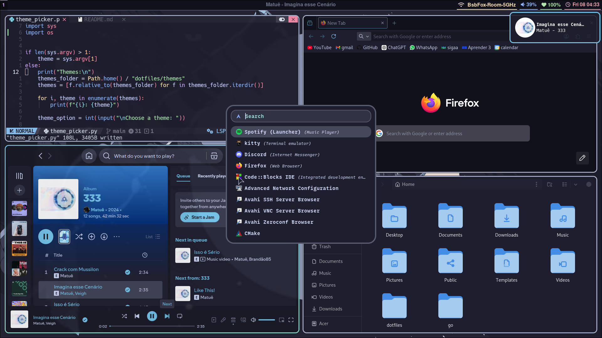
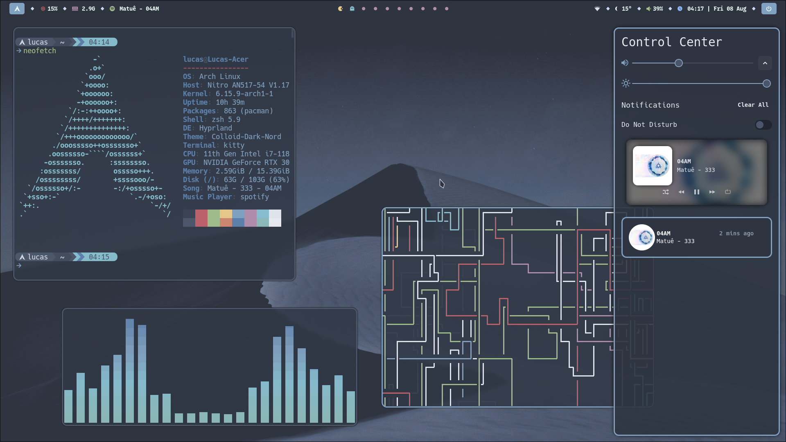

# My Linux Workspace Config

My personal configuration setup for my Linux desktop environment.
Including config files for my window manager (Hyprland),
Neovim setup, shells, and various desktop tools. 

## Hyprland and desktop apps

Configuration for the Hyprland window manager and tools from the ecosystem,
including hyprpaper, hypridle and hyprlock. 
This setup also includes configuration for commonly used applications, such as
waybar, rofi, kitty, swaync and spicetify.

> **Note**: This config is designed to work with uwsm-managed sessions, and may require some
> adjustments for all features to work properly without it.

### Themes

The config includes different desktop themes, which can be added, removed, or switched easily:

- To add a theme make a folder inside the [themes directory](themes/)
- To switch themes, use the `theme_picker.py` script, or the keybind `SUPER SHIFT + T`.

There are also themes for firefox in [firefox_colors/themes.md](firefox_colors/themes.md).

## Neovim

Custom config using [NvChad](https://nvchad.com/), with additional bindings and plugins

### Customization

- Modify key mappings in [mappings.lua](nvim/.config/nvim/lua/mappings.lua)
- Configure options in [options.lua](nvim/.config/nvim/lua/options.lua)
- Configure LSPs in [lspconfig.lua](nvim/.config/nvim/lua/configs/lspconfig.lua)
- Add or remove plugins in [plugins/init.lua](nvim/.config/nvim/lua/plugins/init.lua)
- Set the theme in [chadrc.lua](nvim/.config/nvim/lua/chadrc.lua), or 
run the `:Themes` command

> **Note**: The `chadrc.lua` file is located in the themes directory because it is managed
> by the repo's theme functionality.
> It can be moved to the `nvim` folder if the theme functionality is not being used

## Zsh

My Z-shell configuration using [Oh my zsh](https://ohmyz.sh/)

---
## instalation

To use the configurations from this repository, you can copy the files to their intended locations.
Alternatively, you can use `stow` to symlink each config to its proper path, which is the preferred approach. 
You should also choose a desktop theme following the instructions above, as some programs might not work as expected without it.

### example

First be sure to have GNU stow installed.

Then, you can just run the following command on the root of the repository, to apply neovim's configuration.

```
stow nvim --no-folding
```

That should link the configuration to the correct path. You can do the 
same for any other config in this repository - just use the name of the file
that contains the configuration.

> **note**: `--no-folding` can prevent some bugs, specially when using the theme_picker.

## Screenshots





---
    
## References

- typecraft

    - [YouTube](https://www.youtube.com/@typecraft_dev)

    - [Hyprland Playlist](https://www.youtube.com/playlist?list=PLsz00TDipIfeDrFeSA56W1wPrYYg_Kd-b)

    - [Neovim Playlist](https://www.youtube.com/playlist?list=PLsz00TDipIffreIaUNk64KxTIkQaGguqn)

    - [GitHub Repo](https://github.com/typecraft-dev/dotfiles/)

- [Hyprland Wiki](https://wiki.hyprland.org/)

- [NvChad Docs](https://nvchad.com/docs/quickstart/install)

- [catppuccin](https://catppuccin.com/)

- [catppuccin wallpapers](https://github.com/orangci/walls-catppuccin-mocha)

- [Xakak's dotfiles](https://github.com/Xakak/dotfiles)

- [nordic wallpapers](https://github.com/linuxdotexe/nordic-wallpapers)

- [NelloKudo's dotfiles](https://github.com/NelloKudo/hyprnord-dots/)

- [Nordzy-cursors](https://github.com/guillaumeboehm/Nordzy-cursors/)

- [Spicetify comfy theme](https://github.com/Comfy-Themes/Spicetify/)

- [Colloig gtk theme](https://github.com/vinceliuice/Colloid-gtk-theme)

- [NordArc gtk icons](https://github.com/robertovernina/NordArc)

- [gre0ut's dotfiles](https://github.com/grey0ut/dotfiles/)
